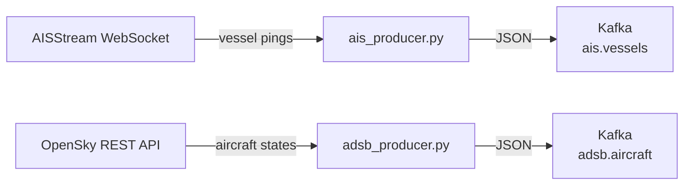

# Geospatial Activity Pipeline

A real-time geospatial intelligence pipeline that ingests live vessel and aircraft positions from AISStream and OpenSky Network across 2 Kafka topics, with configurable bounding box AOIs, automatic WebSocket reconnection, and normalized JSON events published to Kafka.

---

## Table of Contents

- [Overview](#overview)
- [Architecture](#architecture)
- [Tech Stack](#tech-stack)
- [Getting Started](#getting-started)
- [Project Structure](#project-structure)

---

## Overview

Pulls live AIS vessel positions via AISStream WebSocket and ADS-B aircraft transponder data via OpenSky Network REST API. Normalizes raw messages and publishes them to Kafka topics for downstream consumers.

---

## Architecture



---

## Tech Stack

| Layer | Technology |
| ------- | ------------ |
| Streaming | Apache Kafka + Zookeeper |
| Infrastructure | Docker Compose |
| Language | Python 3.13 |
| Config | YAML |

---

## Getting Started

### Prerequisites

- Python 3.13
- Conda
- Docker Desktop
- Git

### Accounts Required

| Service | Purpose | Link |
| --------- | --------- | ------ |
| AISStream | Live vessel WebSocket feed | aisstream.io |
| OpenSky Network | Live aircraft REST API | opensky-network.org |

### Environment Setup

```bash
# Clone the repo
git clone https://github.com/YOUR_USERNAME/geospatial-activity-pipeline.git
cd geospatial-activity-pipeline

# Create conda environment
conda env create -f environment.yaml
conda activate geo-pipeline

# Copy config and fill in credentials
cp config/settings_example.yaml config/settings.yaml

# Start Docker stack
docker compose -f docker/docker-compose.yaml up -d
```

### Running the Pipeline

```bash
# AIS vessel producer
python -m ingestion.ais_producer

# ADS-B aircraft producer
python -m ingestion.adsb_producer
```

---

## Project Structure

```text
geospatial-activity-pipeline/
├── docker/
│   └── docker-compose.yaml
├── ingestion/
│   ├── __init__.py
│   ├── ais_producer.py
│   └── adsb_producer.py
├── config/
│   ├── __init__.py
│   ├── settings.yaml
│   ├── config_loader.py
│   └── logging_config.py
├── environment.yaml
└── README.md
```
