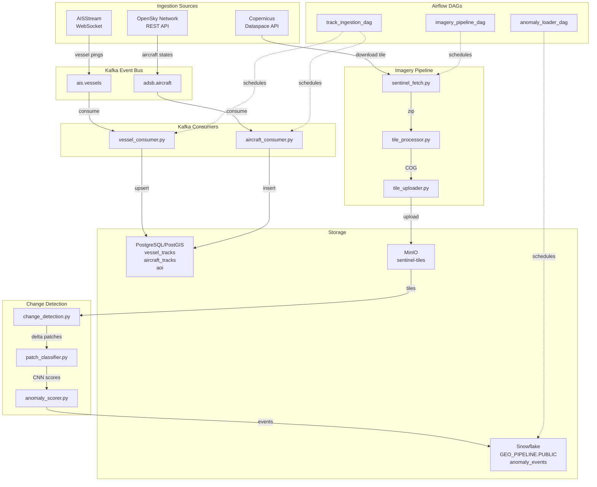

# Geospatial Activity Pipeline

A real-time geospatial intelligence pipeline that ingests live vessel and aircraft positions from AISStream and OpenSky Network across 2 Kafka topics, normalizes and upserts spatial tracks into PostgreSQL/PostGIS with GIST-indexed geometry columns, fetches and processes Sentinel-2 satellite imagery for defined areas of interest, archives Cloud-Optimized GeoTIFF tiles to local S3-compatible object storage, runs NDVI band-difference change detection with PyTorch CNN anomaly scoring, orchestrates all pipelines with Apache Airflow DAGs, and loads scored anomaly events into Snowflake for warehousing and querying.

---

## Table of Contents

- [Overview](#overview)
- [Architecture](#architecture)
- [Tech Stack](#tech-stack)
- [Features](#features)
- [Getting Started](#getting-started)
  - [Prerequisites](#prerequisites)
  - [Environment Setup](#environment-setup)
  - [Running the Pipeline](#running-the-pipeline)
- [Project Structure](#project-structure)

---

## Overview

Pulls live AIS vessel positions via AISStream WebSocket and ADS-B aircraft transponder data via OpenSky Network REST API. Normalizes raw Class A, B, and Extended position reports and aircraft state vectors, publishes them to Kafka topics, and upserts tracks into a PostGIS spatial database with GIST-indexed geometry columns for fast spatial queries. Sentinel-2 satellite tiles are fetched from Copernicus Dataspace, processed with GDAL and Rasterio into Cloud-Optimized GeoTIFFs, and archived to a local MinIO object store. NDVI band-difference change detection flags anomaly patches between tile dates, a lightweight PyTorch CNN scores each patch, and combined confidence-ranked anomaly events are loaded into Snowflake for warehousing. Three Airflow DAGs orchestrate the full pipeline, track ingestion, imagery processing, and anomaly loading, with retries, dependency ordering, and a web UI at localhost:8080.

---

## Architecture



---

## Tech Stack

| Layer | Technology |
| ------- | ------------ |
| Language | Python 3.13 |
| Messaging | Apache Kafka |
| Geospatial DB | PostgreSQL, PostGIS |
| Object Storage | MinIO |
| Imagery | GDAL, Rasterio |
| ML | PyTorch (CPU) |
| Warehouse | Snowflake |
| Orchestration | Docker Compose, Apache Airflow |
| Environment | Conda |

---

## Features

- **2-Source Ingestion** - AISStream WebSocket and OpenSky Network REST API publishing live vessel and aircraft positions to Kafka
- **AIS Normalization** - Handles Class A, Class B Standard, and Class B Extended position reports, normalizing MMSI, vessel name, coordinates, speed, heading, course, and navigational status
- **ADS-B Normalization** - Filters airborne-only records and normalizes ICAO24, callsign, origin country, altitude, velocity, heading, and vertical rate
- **Configurable AOI** - Bounding boxes per data source defined in YAML config, no hardcoded coordinates
- **WebSocket Reconnection** - AIS producer automatically reconnects on connection drop
- **PostGIS Spatial Schema** - Three tables with `GEOMETRY(Point/Polygon, 4326)` columns and GIST spatial indexes: `vessel_tracks`, `aircraft_tracks`, and `aoi`
- **Consumer Lag Monitor** - Reports committed vs end offsets per consumer group and partition on a configurable interval
- **Auto Schema Init** - PostGIS extension and spatial schema applied automatically on container first start via Docker initdb
- **Sentinel-2 Fetch** - Authenticates with Copernicus Dataspace, searches for available L2A tiles over the configured AOI, and downloads the most recent tile
- **Tile Processing** - Extracts B04 and B08 spectral bands, reprojects to WGS84, clips to AOI bounding box, and saves as Cloud-Optimized GeoTIFF using GDAL and Rasterio
- **MinIO Object Storage** - Processed COG tiles uploaded to local S3-compatible bucket organized by date
- **NDVI Change Detection** - Computes NDVI delta between two tile dates and flags 512x512 patches where mean delta exceeds the configured threshold
- **PyTorch Patch Classifier** - Lightweight binary CNN trained on real NDVI delta patches, scoring each anomaly patch with a probability between 0 and 1
- **Anomaly Scorer** - Combines NDVI delta score and CNN confidence into a single ranked confidence score per patch
- **Snowflake Loader** - Loads scored anomaly events into Snowflake GEO_PIPELINE.PUBLIC.anomaly_events with duplicate detection and timestamp tracking
- **Airflow Orchestration** - Three DAGs orchestrating track ingestion hourly, imagery pipeline weekly, and anomaly loading daily with retries and dependency ordering
- **Config-Driven** - YAML-based configuration for Kafka topics, bounding boxes, PostGIS connection, MinIO credentials, Copernicus credentials, Snowflake credentials, AOI definition, and change detection thresholds

---

## Getting Started

### Prerequisites

- [Docker Desktop](https://www.docker.com/)
- [Miniconda](https://docs.conda.io/en/latest/miniconda.html) or Anaconda
- Python 3.13

### Accounts Required

| Service | Purpose | Link |
| --------- | --------- | ------ |
| AISStream | Live vessel WebSocket feed | aisstream.io |
| OpenSky Network | Live aircraft REST API | opensky-network.org |
| Copernicus Dataspace | Sentinel-2 satellite imagery | dataspace.copernicus.eu |
| Snowflake | Anomaly event warehouse | snowflake.com |

### Environment Setup

**1. Clone the repository:**

```bash
# Clone the repo
git clone https://github.com/cristi4nhdz/geospatial-activity-pipeline.git
cd geospatial-activity-pipeline
```

**2. Configure your environment:**

```bash
cp config/settings_example.yaml config/settings.yaml
# edit settings.yaml with your API keys and credentials
```

**3. Create a local Conda environment:**

```bash
conda env create -f environment.yaml
conda activate geo-pipeline
```

**4. Start the Docker stack:**

```bash
docker compose -f docker/docker-compose.yaml up -d
```

**5. Create MinIO bucket:**

```bash
python -m imagery.minio_setup
```

**6. Set up Snowflake:**

```bash
python -m snowflake_loader.setup
```

### Running the Pipeline

```bash
# AIS vessel producer
python -m ingestion.ais_producer

# ADS-B aircraft producer
python -m ingestion.adsb_producer

# Vessel consumer
python -m ingestion.consumers.vessel_consumer

# Aircraft consumer
python -m ingestion.consumers.aircraft_consumer

# Lag monitor
python -m ingestion.consumers.lag_monitor

# Sentinel-2 fetch
python -m imagery.sentinel_fetch

# Tile processor
python -m imagery.tile_processor

# Tile uploader
python -m imagery.tile_uploader

# Change detection
python -m imagery.change_detection

# Train patch classifier
python -m imagery.patch_classifier

# Score anomalies
python -m imagery.anomaly_scorer

# Load anomaly events to Snowflake
python -m snowflake_loader.anomaly_loader
```

---

## Project Structure

```text
geospatial-activity-pipeline/
|-- docker/
│   |-- docker-compose.yaml
│   |-- postgres/
│       |-- init.sql
|-- dags/
|   |-- __init__.py
|   |-- imagery_pipeline_dag.py
|   |-- track_ingestion_dag.py
|   |-- anomaly_loader_dag.py
|-- ingestion/
│   |-- __init__.py
│   |-- ais_producer.py
│   |-- adsb_producer.py
|   |-- consumers/
|       |-- __init__.py
|       |-- vessel_consumer.py
|       |-- aircraft_consumer.py
|       |-- lag_monitor.py
|-- imagery/
|   |-- __init__.py
|   |-- minio_setup.py
|   |-- sentinel_fetch.py
|   |-- tile_processor.py
|   |-- tile_uploader.py
|   |-- change_detection.py
|   |-- patch_classifier.py
|   |-- anomaly_scorer.py
|   |-- weights/
|   |-- events/
|   |-- downloads/
|   |-- processed/
|-- snowflake_loader/
|   |-- __init__.py
|   |-- setup.py
|   |-- anomaly_loader.py
|-- db/
│   |-- schema.sql
│   |-- queries/
|-- config/
│   |-- __init__.py
│   |-- settings_example.yaml
│   |-- config_loader.py
│   |-- logging_config.py
|-- logs/
|-- environment.yaml
|-- README.md
```
