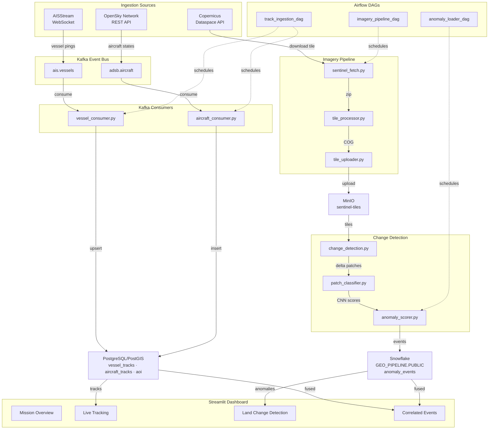
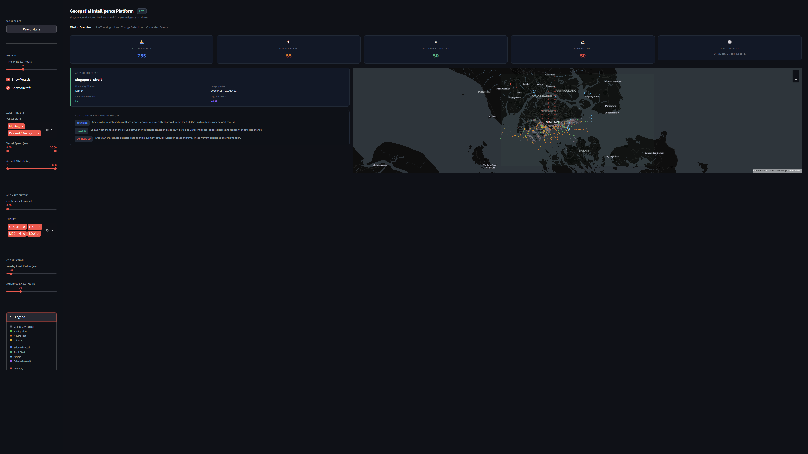
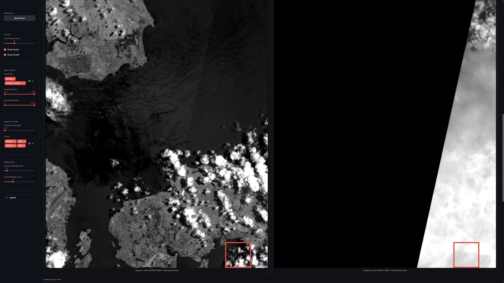
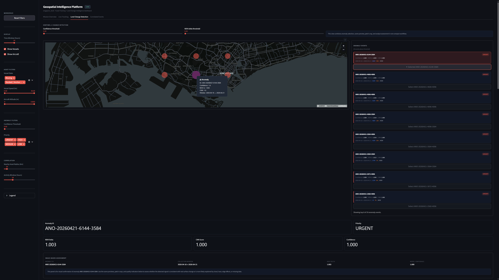
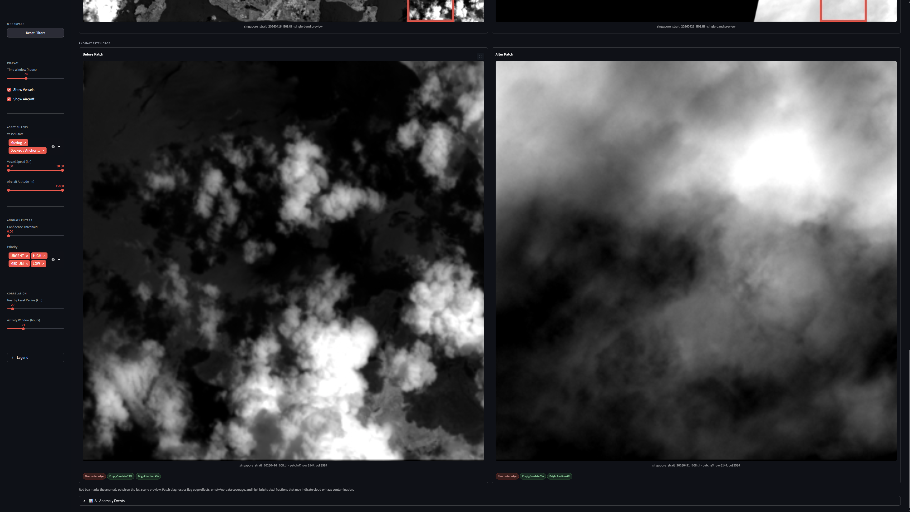
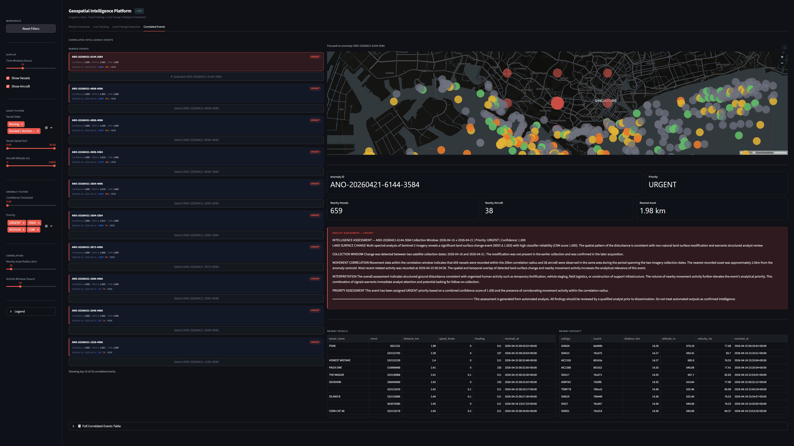

# Geospatial Activity Pipeline

[](https://www.python.org/downloads/)
[](https://github.com/cristi4nhdz/geospatial-activity-pipeline/actions/workflows/test.yml)
[](https://codecov.io/gh/cristi4nhdz/osint-threat-intel-pipeline)


A real-time geospatial intelligence pipeline that ingests live vessel and aircraft positions from AISStream and OpenSky Network across 2 Kafka topics, normalizes and upserts spatial tracks into PostgreSQL/PostGIS with GIST-indexed geometry columns, fetches and processes Sentinel-2 satellite imagery for defined areas of interest, archives Cloud-Optimized GeoTIFF tiles to local S3-compatible object storage, runs NDVI band-difference change detection with PyTorch CNN anomaly scoring, orchestrates all pipelines with Apache Airflow DAGs, loads scored anomaly events into Snowflake for warehousing and querying, and displays fused intelligence through a 4-tab Streamlit dashboard with live tracking, land-change detection, and correlated event analysis.

---

## Table of Contents

- [Overview](#overview)
- [Architecture](#architecture)
- [Screenshots](#screenshots)
- [Tech Stack](#tech-stack)
- [Features](#features)
- [Getting Started](#getting-started)
  - [Prerequisites](#prerequisites)
  - [Environment Setup](#environment-setup)
  - [Running the Pipeline](#running-the-pipeline)
- [Project Structure](#project-structure)

---

## Overview

Pulls live AIS vessel positions via AISStream WebSocket and ADS-B aircraft transponder data via OpenSky Network REST API. Normalizes raw Class A, B, and Extended position reports and aircraft state vectors, publishes them to Kafka topics, and upserts tracks into a PostGIS spatial database with GIST-indexed geometry columns for fast spatial queries. Sentinel-2 satellite tiles are fetched from Copernicus Dataspace, processed with GDAL and Rasterio into Cloud-Optimized GeoTIFFs, and archived to a local MinIO object store. NDVI band-difference change detection flags anomaly patches between tile dates, a lightweight PyTorch CNN scores each patch, and combined confidence-ranked anomaly events are loaded into Snowflake for warehousing. Three Airflow DAGs orchestrate the full pipeline with retries and dependency ordering. A 4-tab Streamlit dashboard fuses live vessel and aircraft tracking with Sentinel-2 land-change detection and anomaly correlation into a single intelligence workspace. The pipeline is covered by 133 pytest tests at 82% coverage.

---

## Architecture



---

## Screenshots

### Mission Overview



### Live Tracking


### Land Change Detection



### Sentinel Scene Preview



### Anomaly Patch Crop



### Correlated Events



### Analyst Assessment


---

## Tech Stack

| Layer | Technology |
| ------- | ------------ |
| Language | Python 3.13 |
| Messaging | Apache Kafka |
| Geospatial DB | PostgreSQL, PostGIS |
| Object Storage | MinIO |
| Imagery | GDAL, Rasterio |
| ML | PyTorch |
| Warehouse | Snowflake |
| Dashboard | Streamlit, pydeck |
| Orchestration | Docker Compose, Apache Airflow |
| Infrastructure | Docker Compose |
| Testing | pytest,  pytest-cov |
| Environment | Conda |
| Environment | flake8, pylint, black, mypy, yamllint |

---

## Features

- **2-Source Ingestion** - AISStream WebSocket and OpenSky Network REST API publishing live vessel and aircraft positions to Kafka
- **AIS Normalization** - Handles Class A, Class B Standard, and Class B Extended position reports, normalizing MMSI, vessel name, coordinates, speed, heading, course, and navigational status
- **ADS-B Normalization** - Filters airborne-only records and normalizes ICAO24, callsign, origin country, altitude, velocity, heading, and vertical rate
- **PostGIS Spatial Schema** - Three tables with `GEOMETRY(Point/Polygon, 4326)` columns and GIST spatial indexes: `vessel_tracks`, `aircraft_tracks`, and `aoi`
- **Sentinel-2 Fetch** - Authenticates with Copernicus Dataspace, searches for available L2A tiles over the configured AOI, and downloads the most recent tile
- **Tile Processing** - Extracts B04 and B08 spectral bands, reprojects to WGS84, clips to AOI bounding box, and saves as Cloud-Optimized GeoTIFF using GDAL and Rasterio
- **NDVI Change Detection** - Computes NDVI delta between two tile dates and flags 512x512 patches where mean delta exceeds the configured threshold
- **PyTorch Patch Classifier** - Lightweight binary CNN trained on real NDVI delta patches, scoring each anomaly patch with a probability between 0 and 1
- **Anomaly Scorer** - Combines NDVI delta score and CNN confidence into a single ranked confidence score per patch
- **Snowflake Loader** - Loads scored anomaly events into Snowflake GEO_PIPELINE.PUBLIC.anomaly_events with duplicate detection and timestamp tracking
- **Airflow Orchestration** - Three DAGs orchestrating track ingestion hourly, imagery pipeline weekly, and anomaly loading daily with retries and dependency ordering
- **4-Tab Streamlit Dashboard** - Mission overview with KPI cards and AOI summary, live vessel and aircraft tracking with loitering detection and speed colour encoding, Sentinel-2 before/after scene previews with patch bounding box and quality diagnostic chips, and correlated event analysis with priority-ranked anomaly list and template-based analyst narrative
- **Fused Intelligence** - Correlates satellite-detected land-surface change with nearby vessel and aircraft movement in space and time, assigning URGENT/HIGH/MEDIUM/LOW priority by combined confidence score and nearby asset count
- **Loitering Detection** - Identifies vessels with ≥8 pings, avg speed ≤5kn, operating within a 1.5km radius over ≥45 minutes
- **pytest Suite** - 133 tests at 82% coverage across ingestion normalization, spatial schema, DAG structure, imagery pipeline, consumers, MinIO, and Snowflake loader

---

## Getting Started

### Prerequisites

- [Docker Desktop](https://www.docker.com/)
- [Miniconda](https://docs.conda.io/en/latest/miniconda.html) or Anaconda
- Python 3.13

### Accounts Required

| Service | Purpose | Link |
| --------- | --------- | ------ |
| AISStream | Live vessel WebSocket feed | aisstream.io |
| OpenSky Network | Live aircraft REST API | opensky-network.org |
| Copernicus Dataspace | Sentinel-2 satellite imagery | dataspace.copernicus.eu |
| Snowflake | Anomaly event warehouse | snowflake.com |

### Environment Setup

**1. Clone the repository:**

```bash
git clone https://github.com/cristi4nhdz/geospatial-activity-pipeline.git
cd geospatial-activity-pipeline
```

**2. Configure your environment:**

```bash
cp config/settings_example.yaml config/settings.yaml
# edit settings.yaml with your API keys and credentials
```

**3. Create a local Conda environment:**

```bash
conda env create -f environment.yaml
conda activate geo-pipeline
```

**4. Create MinIO bucket:**

```bash
python -m imagery.minio_setup
```

**5. Set up Snowflake:**

```bash
python -m snowflake_loader.setup
```

### Running the Pipeline

**Start the full pipeline:**

```bash
docker compose -f docker/docker-compose.yaml up -d
```

```bash

# AIS vessel producer
python -m ingestion.ais_producer

# ADS-B aircraft producer
python -m ingestion.adsb_producer

# Vessel consumer
python -m ingestion.consumers.vessel_consumer

# Aircraft consumer
python -m ingestion.consumers.aircraft_consumer

# Lag monitor
python -m ingestion.consumers.lag_monitor

# Sentinel-2 fetch
python -m imagery.sentinel_fetch

# Tile processor
python -m imagery.tile_processor

# Tile uploader
python -m imagery.tile_uploader

# Change detection
python -m imagery.change_detection

# Train patch classifier
python -m imagery.patch_classifier

# Score anomalies
python -m imagery.anomaly_scorer

# Load anomaly events to Snowflake
python -m snowflake_loader.anomaly_loader

# Intelligence dashboard
python -m streamlit run dashboard/app.py
```

**Run tests:**

```bash
pytest
```

**Shut down:**

```bash
docker compose down
```

---

### Test Coverage

| Module | Statements | Coverage |
| --- | --- | --- |
| `ingestion/ais_producer.py` | 53 | 43% |
| `ingestion/adsb_producer.py` | 64 | 94% |
| `ingestion/consumers/vessel_consumer.py` | 42 | 79% |
| `ingestion/consumers/aircraft_consumer.py` | 42 | 86% |
| `ingestion/consumers/lag_monitor.py` | 45 | 93% |
| `imagery/minio_setup.py` | 26 | 96% |
| `imagery/tile_uploader.py` | 43 | 79% |
| `imagery/change_detection.py` | 78 | 77% |
| `imagery/patch_classifier.py` | 103 | 79% |
| `imagery/anomaly_scorer.py` | 69 | 80% |
| `snowflake_loader/setup.py` | 26 | 96% |
| `snowflake_loader/anomaly_loader.py` | 48 | 98% |
| **Total** | **639** | **82%** |

---

## Project Structure

```text
geospatial-activity-pipeline/
|-- docker/                              # Docker Compose stack and Postgres init
│   |-- docker-compose.yaml             # Kafka, Zookeeper, PostGIS, MinIO, Airflow services
│   |-- postgres/
│       |-- init.sql                    # PostGIS extension and spatial schema on first start
|-- dags/                               # Airflow DAG definitions
|   |-- __init__.py
|   |-- imagery_pipeline_dag.py         # Weekly Sentinel fetch, tile processing, and upload
|   |-- track_ingestion_dag.py          # Hourly vessel and aircraft consumer orchestration
|   |-- anomaly_loader_dag.py           # Daily scored anomaly event loading to Snowflake
|-- ingestion/                          # AIS and ADS-B data ingestion
│   |-- __init__.py
│   |-- ais_producer.py                 # AISStream WebSocket producer publishing to ais.vessels
│   |-- adsb_producer.py                # OpenSky REST producer publishing to adsb.aircraft
|   |-- consumers/
|       |-- __init__.py
|       |-- vessel_consumer.py          # Consumes ais.vessels and upserts to PostGIS
|       |-- aircraft_consumer.py        # Consumes adsb.aircraft and inserts to PostGIS
|       |-- lag_monitor.py              # Reports Kafka consumer group lag per partition
|-- imagery/                            # Sentinel-2 imagery pipeline
|   |-- __init__.py
|   |-- minio_setup.py                  # Creates sentinel-tiles bucket in MinIO
|   |-- sentinel_fetch.py               # Authenticates with Copernicus and downloads L2A tiles
|   |-- tile_processor.py               # Extracts B04/B08 bands and saves as Cloud-Optimized GeoTIFF
|   |-- tile_uploader.py                # Uploads processed COG tiles to MinIO
|   |-- change_detection.py             # NDVI band-difference change detection between tile dates
|   |-- patch_classifier.py             # PyTorch CNN scoring anomaly patches 0–1
|   |-- anomaly_scorer.py               # Combines NDVI delta and CNN score into ranked confidence
|   |-- weights/                        # Trained CNN model weights
|   |-- events/                         # Scored anomaly event outputs
|   |-- downloads/                      # Raw downloaded Sentinel tile zips
|   |-- processed/                      # Processed Cloud-Optimized GeoTIFFs
|-- snowflake_loader/                   # Snowflake schema and event loading
|   |-- __init__.py
|   |-- setup.py                        # Creates GEO_PIPELINE.PUBLIC.anomaly_events table
|   |-- anomaly_loader.py               # Loads scored anomaly events into Snowflake with deduplication
|-- dashboard/                          # 4-tab Streamlit intelligence dashboard
|   |-- __init__.py
|   |-- app.py                          # Main dashboard entry point and tab layout
|   |-- components/
|       |-- __init__.py
|       |-- track_map.py                # PostGIS vessel/aircraft fetchers and loitering detection
|       |-- anomaly_feed.py             # Snowflake anomaly event fetchers
|       |-- correlation.py              # Haversine proximity, anomaly centering, priority assignment
|       |-- analyst_summary.py          # Template-based intelligence narrative generator
|       |-- kpi.py                      # KPI cards, AOI summary, and anomaly event cards
|-- tests/                              # pytest test suite
|   |-- __init__.py
|   |-- conftest.py                     # Shared fixtures and test configuration
|   |-- test_ingestion.py               # AIS and ADS-B normalization tests
|   |-- test_spatial.py                 # PostGIS schema and spatial query tests
|   |-- test_dags.py                    # Airflow DAG structure and dependency tests
|   |-- test_imagery.py                 # Sentinel fetch, tile processing, and change detection tests
|   |-- test_consumers.py               # Vessel and aircraft consumer tests
|   |-- test_minio.py                   # MinIO bucket setup and upload tests
|   |-- test_snowflake.py               # Snowflake loader and schema setup tests
|-- db/
│   |-- schema.sql                      # PostGIS table definitions and GIST index setup
│   |-- queries/                        # Reusable spatial SQL queries
|-- config/
│   |-- __init__.py
│   |-- settings_example.yaml           # Template config with all required fields
│   |-- config_loader.py                # Loads and validates settings.yaml at startup
│   |-- logging_config.py               # Shared logging configuration
|-- docs/                               # Screenshots for README
|-- logs/                               # Runtime log output
|-- .coveragerc                         # pytest coverage configuration
|-- environment.yaml                    # Conda environment spec
|-- README.md
```
